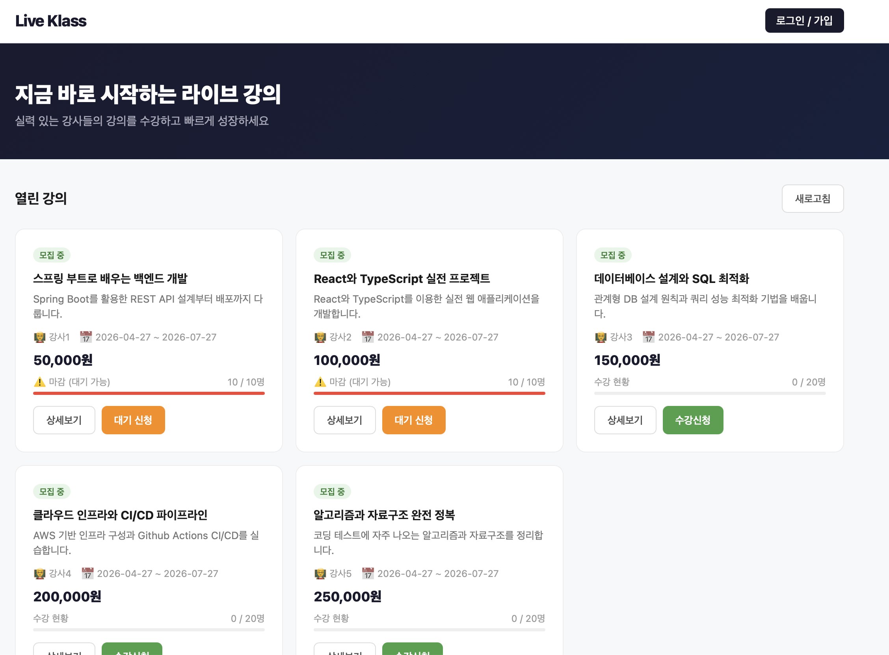
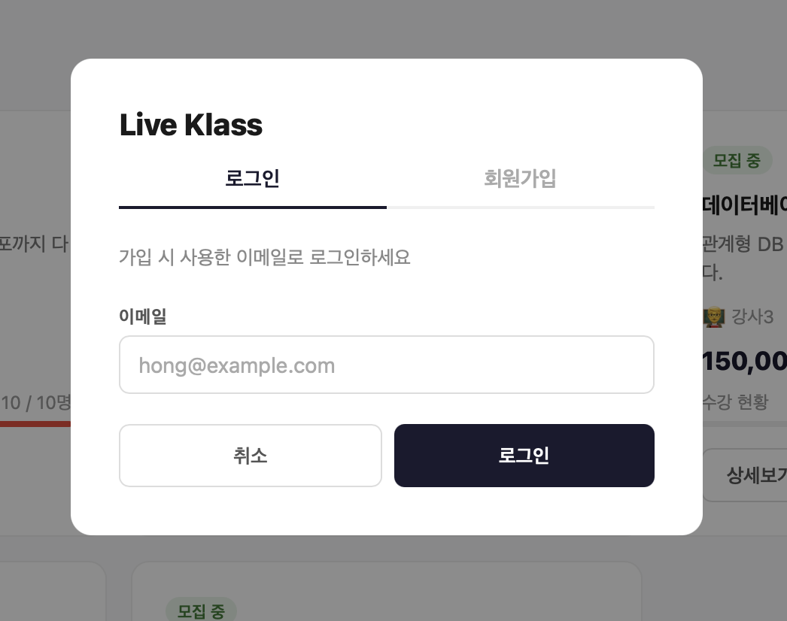
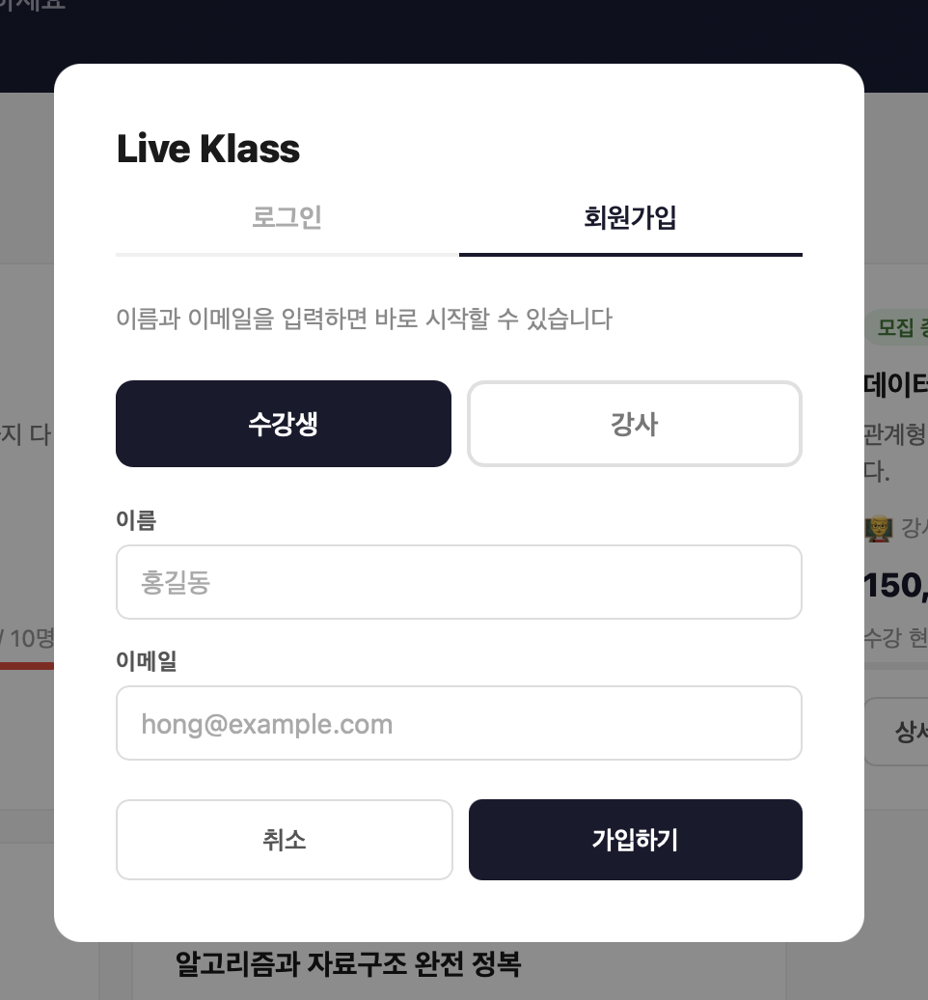
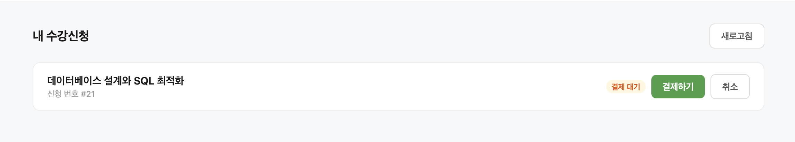
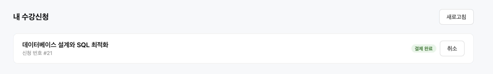
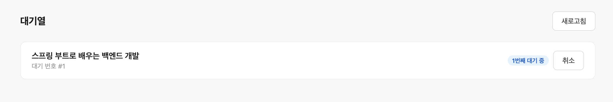
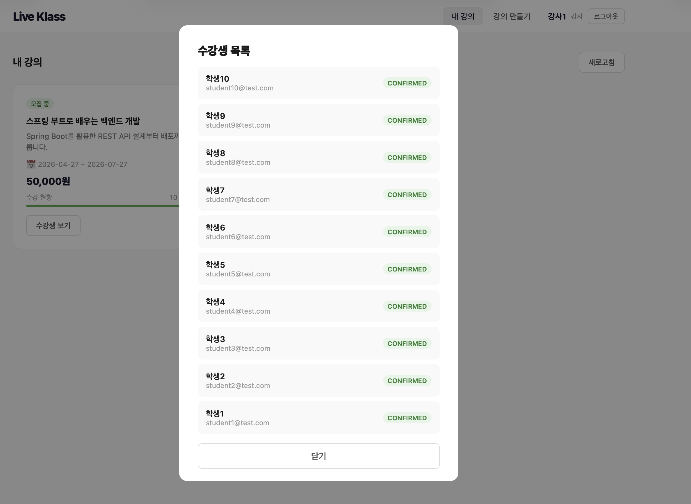

# Live Klass Test

## 프로젝트 개요

라이브 강의 수강 신청 시스템 백엔드 과제입니다.
크리에이터가 강의를 개설하고, 수강생이 신청·결제·취소할 수 있으며, 정원 초과 시 대기열에 자동 등록되는 기능을 구현했습니다.

---

## 기술 스택

| 분류 | 사용 기술 |
|------|-----------|
| Language | Java 17 |
| Framework | Spring Boot 4.0.5 |
| ORM | Spring Data JPA, QueryDSL 5.1.0 |
| DB (운영) | MySQL 8 |
| DB (테스트) | H2 (in-memory, MySQL 호환 모드) |
| 빌드 | Gradle |
| 컨테이너 | Docker / Docker Compose |
| 기타 | Lombok, Spring Validation |

---

## 실행 방법

MySQL과 애플리케이션을 한 번에 실행합니다. Java나 MySQL을 별도로 설치할 필요가 없습니다.

```bash
docker-compose up --build
```

서버가 기동되면 `http://localhost:8080` 에서 접속할 수 있습니다.

강사 이메일 : creator1@test.com \
학생 이메일 : student1@test.com

---

## 요구사항 해석

- 회원은 `STUDENT`와 `CREATOR` 두 가지 역할로 구분됩니다.
- 강의는 `DRAFT → OPEN → CLOSED` 상태 흐름을 가지며, `OPEN` 상태에서만 수강 신청이 가능합니다.
- 수강 신청 시 정원이 초과된 경우, 자동으로 대기열에 등록됩니다.
- 수강 신청 후 결제(`PENDING → CONFIRMED`)는 별도 API로 처리합니다. 즉, 수강 신청과 결제는 분리된 흐름입니다.
- 결제 완료(`CONFIRMED`) 후 취소는 7일 이내에만 가능합니다.
- 대기열에서 수강 전환(`PROMOTED`)된 후 48시간 내 결제하지 않으면 시스템이 자동으로 만료 처리하고, 다음 대기자를 승격시킵니다.

---

## 설계 결정과 이유

### 동시성 제어 - 비관적 락(Pessimistic Lock)

수강 신청 시 정원 초과 여부를 확인하는 구간에서 `SELECT ... FOR UPDATE`를 적용했습니다.
낙관적 락 대비 충돌이 실제로 발생할 가능성이 높은 선착순 신청 시나리오를 가정했기 때문에 비관적 락을 선택했습니다.

### 대기열 자동 승격

수강 취소 발생 시 `WaitListService.promoteNextInLine()`을 호출하여 대기열 1순위 수강생을 자동으로 수강 신청 상태(`PENDING`)로 전환합니다.
대기 전환 시에도 락을 획득하여 중복 전환을 방지합니다.


### 스케줄러

- 매일 자정: 종료일이 지난 `OPEN` 강의를 `CLOSED`로 자동 전환
- 매 시간: 대기열에서 수강 전환 후 48시간이 지난 미결제 건을 만료 처리 및 다음 대기자 승격

---


## AI 활용 범위

- QueryDSL 동적 쿼리 작성 시 문법 참고
- 전체적인 코드 검토 및 리팩토링
- README 작성 보조
- 간단한 화면 구성 코드 작성

---

## 화면 구성

### 메인 (강의 탐색)



강의 목록을 카드 형태로 표시합니다. 수강 현황 바로 만석 여부를 확인할 수 있으며, 만석인 강의는 대기 신청으로 전환됩니다.

### 로그인 / 회원가입




탭으로 로그인과 회원가입을 전환할 수 있습니다. 로그인은 이메일만 입력하면 되고, 회원가입 시 수강생 / 강사 역할을 선택합니다.

### 내 수강신청 (수강생)





신청한 강의 목록과 결제 상태를 확인하고, 결제 및 취소를 처리할 수 있습니다.

### 대기열 (수강생)



대기 중인 강의 목록과 순번을 확인하고, 대기를 취소할 수 있습니다.

### 내 강의 / 강의 만들기 (강사)



개설한 강의의 수강 현황을 확인하고, 새 강의를 개설할 수 있습니다.

---

## API 목록 및 예시

### 회원 (Members)

| Method | URL | 설명 |
|--------|-----|------|
| POST | `/api/members` | 수강생 회원가입 |
| POST | `/api/members/creator` | 크리에이터 회원가입 |
| POST | `/api/members/login` | 로그인 (이메일 기반) |

**POST /api/members**
```json
// Request
{
  "name": "홍길동",
  "email": "hong@example.com"
}

// Response 201
{
  "result": { "id": 1 }
}
```

**POST /api/members/login**
```json
// Request
{
  "email": "hong@example.com"
}

// Response 200
{
  "result": {
    "id": 1,
    "name": "홍길동",
    "role": "student"
  }
}
```

---

### 강의 (LiveClass)

| Method | URL | 설명 |
|--------|-----|------|
| POST | `/api/classes?creatorId={id}` | 강의 생성 |
| DELETE | `/api/classes/{classId}?creatorId={id}` | 강의 삭제 |
| GET | `/api/classes?status={status}` | 강의 목록 조회 (status 미입력 시 전체) |
| GET | `/api/classes/{classId}` | 강의 상세 조회 |
| PATCH | `/api/classes/{classId}/open?creatorId={id}` | 강의 오픈 (DRAFT → OPEN) |

**POST /api/classes?creatorId=1**
```json
// Request
{
  "title": "Spring Boot 입문",
  "description": "스프링 부트 기초 강의입니다.",
  "price": 50000,
  "maxCapacity": 30,
  "startDate": "2026-05-01",
  "endDate": "2026-05-31"
}

// Response 201
{
  "classId": 1
}
```

**GET /api/classes?status=OPEN**
```json
// Response 200
{
  "classes": [
    {
      "title": "Spring Boot 입문",
      "startDate": "2026-05-01",
      "endDate": "2026-05-31",
      "status": "OPEN"
    }
  ]
}
```

**GET /api/classes/1**
```json
// Response 200
{
  "classId": 1,
  "title": "Spring Boot 입문",
  "description": "스프링 부트 기초 강의입니다.",
  "price": 50000,
  "maxCapacity": 30,
  "currentEnrollmentCount": 12,
  "startDate": "2026-05-01",
  "endDate": "2026-05-31",
  "status": "OPEN"
}
```

---

### 수강 신청 (Enrollment)

| Method | URL | 설명 |
|--------|-----|------|
| POST | `/api/enrollments` | 수강 신청 (정원 초과 시 대기열 자동 등록) |
| DELETE | `/api/enrollments/{enrollmentId}?memberId={memberId}` | 수강 취소 |
| POST | `/api/enrollments/payment` | 결제 처리 |
| GET | `/api/enrollments/my/{memberId}` | 내 수강 목록 조회 |
| GET | `/api/enrollments/class/{classId}?creatorId={id}` | 강의 수강생 목록 (크리에이터 전용) |

**POST /api/enrollments**
```json
// Request
{
  "liveClassId": 1,
  "memberId": 2
}

// Response 201 - 수강 신청 성공
{
  "resultType": "ENROLLED",
  "id": 10,
  "waitListPosition": null
}

// Response 201 - 정원 초과, 대기열 등록
{
  "resultType": "WAITLISTED",
  "id": 3,
  "waitListPosition": 1
}
```

**DELETE /api/enrollments/{enrollmentId}?memberId={memberId}**
```
// Response 200 {}
```

**POST /api/enrollments/payment**
```json
// Request
{
  "enrollmentId": 10,
  "memberId": 2
}

// Response 200
{
  "enrollmentId": 10
}
```

---

### 대기열 (WaitList)

| Method | URL | 설명 |
|--------|-----|------|
| GET | `/api/waitlists/my/{memberId}` | 내 대기열 목록 조회 |
| DELETE | `/api/waitlists/{waitListId}?memberId={id}` | 대기열 취소 |

**GET /api/waitlists/my/2**
```json
// Response 200
[
  {
    "waitListId": 3,
    "classTitle": "Spring Boot 입문",
    "position": 1,
    "status": "WAITING"
  }
]
```

---

## 데이터 모델 설명

### Member (회원)

| 컬럼 | 타입 | 설명 |
|------|------|------|
| member_id | Long | PK |
| name | String | 이름 |
| email | String | 이메일 (unique) |
| role | Enum | `STUDENT` / `CREATOR` |

---

### LiveClass (강의)

| 컬럼 | 타입 | 설명 |
|------|------|------|
| live_class_id | Long | PK |
| title | String | 강의 제목 |
| description | String | 강의 설명 |
| price | int | 수강료 |
| maxCapacity | int | 최대 정원 |
| startDate | LocalDate | 강의 시작일 |
| endDate | LocalDate | 강의 종료일 |
| status | Enum | `DRAFT` / `OPEN` / `CLOSED` |
| member_id | FK | 크리에이터(Member) |

---

### Enrollment (수강 신청)

| 컬럼 | 타입 | 설명 |
|------|------|------|
| enrollment_id | Long | PK |
| status | Enum | `PENDING` / `CONFIRMED` / `CANCELLED` |
| confirmedAt | LocalDateTime | 결제 완료 시각 |
| member_id | FK | 수강생(Member) |
| live_class_id | FK | 강의(LiveClass) |

---

### WaitList (대기열)

| 컬럼 | 타입 | 설명 |
|------|------|------|
| wait_list_id | Long | PK |
| member_id | FK | 회원(Member) |
| live_class_id | FK | 강의(LiveClass) |
| enrollment_id | FK | 승격된 수강신청(Enrollment), nullable |
| position | int | 대기 순번 |
| status | Enum | `WAITING` / `PROMOTED` / `CANCELLED` |
| promotedAt | LocalDateTime | 대기열 승격 시각 |

---

### Payment (결제)

| 컬럼 | 타입 | 설명 |
|------|------|------|
| payment_id | Long | PK |
| memberId | Long | 회원 ID |
| liveClassId | Long | 강의 ID |
| enrollmentId | Long | 수강신청 ID |
| price | int | 결제 금액 |
| status | Enum | `PAID` / `CANCELLED` |

---

## 테스트 실행 방법

테스트는 H2 인메모리 DB를 사용하므로 별도의 DB 설정 없이 실행 가능합니다.

```bash
# 전체 테스트 실행
./gradlew test

# 특정 테스트 클래스 실행
./gradlew test --tests "com.example.live_klass_test.enrollment.EnrollmentServiceTest"
./gradlew test --tests "com.example.live_klass_test.concurrency.EnrollmentConcurrencyTest"
./gradlew test --tests "com.example.live_klass_test.waitlist.WaitListIntegrationTest"
```

### 테스트 구성

| 테스트 클래스 | 유형 | 설명 |
|--------------|------|------|
| `EnrollmentServiceTest` | 단위 테스트 | 수강 신청/취소/결제 비즈니스 로직 |
| `LiveClassServiceTest` | 단위 테스트 | 강의 생성/오픈/삭제 비즈니스 로직 |
| `MemberServiceTest` | 단위 테스트 | 회원 가입 비즈니스 로직 |
| `WaitListIntegrationTest` | 통합 테스트 | 대기열 등록 및 승격 흐름 |
| `EnrollmentConcurrencyTest` | 동시성 테스트 | 동시 수강 신청 시 정원 초과 방지 |
